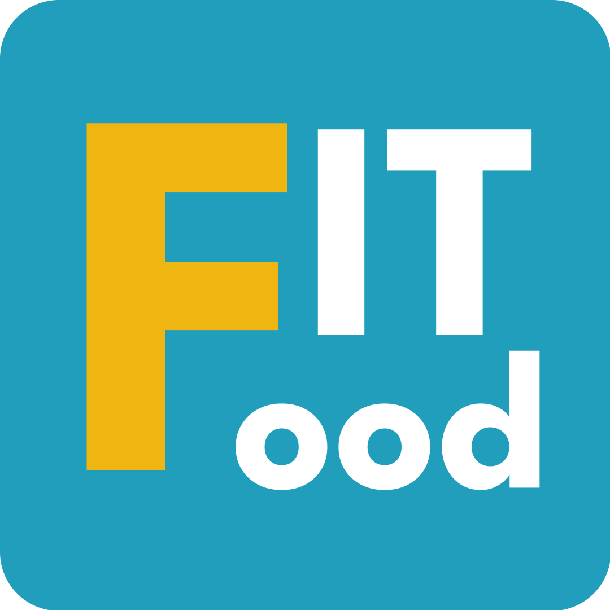

# FitFood

An App that prioritizes the utilization of personal data to offer personalized solutions, thereby facilitating users' health goals more effectively and conveniently. The app will provide food and exercise recommendations based on the user's Body Mass Index (BMI). 

# Features
- BMI Calculation: Users can input their weight, height, and age to calculate their BMI. The app uses this information to provide personalized recommendations.
- Personalized Recommendations: Based on the user's BMI, the app suggests appropriate food and exercise plans.
- Food Calorie Checker: A feature that allows users to quickly and accurately determine the calorie content of various foods.
- Meal and Workout Reminder Feature: Helps users stay on track with their nutrition goals by setting reminders for meals throughout the day.
- FitFood AI Chat
- Food Image Recognition using Machine Learning

# Technology
- Model-View-ViewModel (MVVM)
- Live Data
- Data Binding
- Kotlin Coroutines
- Android Jetpack’s Data Store
- Retrofit
- Room Database
- Dependency Injection
- Observer Pattern
